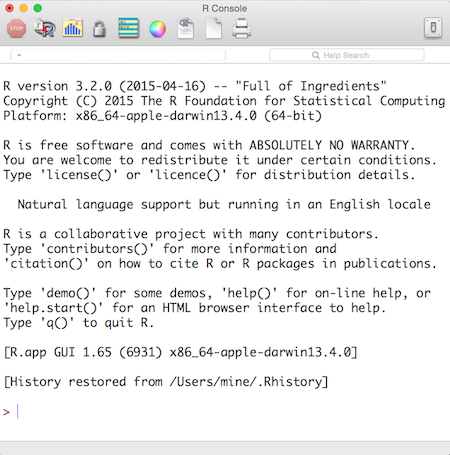
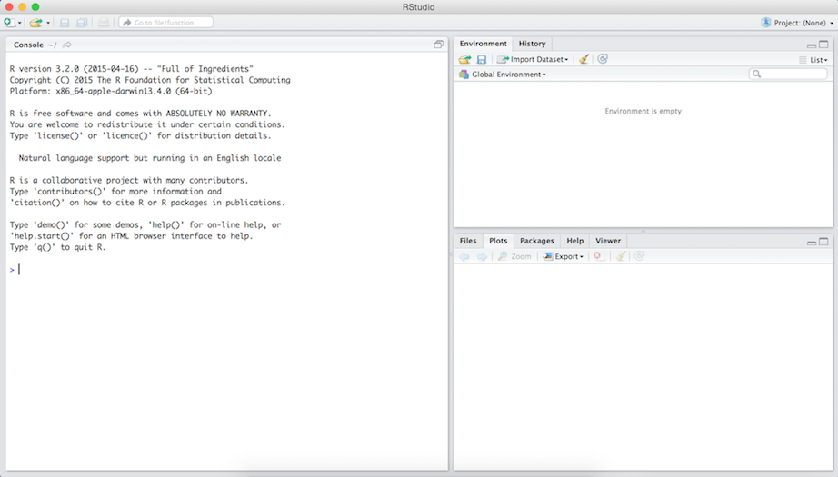

## Materials

- Slides at 
- All source code at 
- *Very* useful resources from RStudio:
    + [RMarkdown cheat sheet](http://www.rstudio.com/wp-content/uploads/2015/02/rmarkdown-cheatsheet.pdf)
    + Others at http://www.rstudio.com/resources/cheatsheets
        + ggplot2: for visualization
        + dplyr: for data manipulation
        + ...


# Reproducibility: who cares?

## Science retracts gay marriage paper without agreement of lead author LaCour

- In May 2015 Science retracted a study of how canvassers can sway 
people's opinions about gay marriage published just 5 months ago.

- Science Editor-in-Chief Marcia McNutt: Original survey data not made 
available for independent reproduction of results. + Survey incentives 
misrepresented. + Sponsorship statement false.

- Two Berkeley grad students who attempted to replicate the study quickly 
discovered that the data must have been faked.

- Methods we'll discuss today can't prevent this, but they can make it 
easier to discover issues.

Source: http://news.sciencemag.org/policy/2015/05/science-retracts-gay-marriage-paper-without-lead-author-s-consent


## Seizure study retracted after authors realize data got "terribly mixed"

From the authors of **Low Dose Lidocaine for Refractory Seizures in 
Preterm Neonates**:

*"The article has been retracted at the request of the authors. After 
carefully re-examining the data presented in the article, they identified 
that data of two different hospitals got terribly mixed. The published 
results cannot be reproduced in accordance with scientific and clinical 
correctness."*

Source: http://retractionwatch.com/2013/02/01/seizure-study-retracted-after-authors-realize-data-got-terribly-mixed/


## Bad spreadsheet merge kills depression paper, quick fix resurrects it

- The authors informed the journal that the merge of lab results and other 
survey data used in the paper resulted in an error regarding the 
identification codes. Results of the analyses were based on the data set 
in which this error occurred. Further analyses established the results 
reported in this manuscript and interpretation of the data are not correct.

- **Original conclusion:** Lower levels of CSF IL-6 were associated with 
current depression and with future depression [...].

- **Revised conclusion:** Higher levels of CSF IL-6 and IL-8 were 
associated with current depression [...].

Source: http://retractionwatch.com/2014/07/01/bad-spreadsheet-merge-kills-depression-paper-quick-fix-resurrects-it/


# Reproducibility: why should we care?

## Two-pronged approach

<div class="columns-2">
\#1 
Convince researchers to adopt a reproducible research workflow

<br><br>

\#2
Train new researchers who don’t have any other workflow


</div>

## Reproducible data analysis

- Scriptability $\rightarrow$ R

- Literate programming $\rightarrow$ R Markdown

- Version control $\rightarrow$ Git / GitHub

# Departmental computing resources

## Departmental computing resources

- Graduate student computers are shared departmental resources
    + You'll be assigned a desktop to which you have priority, but it may 
    be used by others as well (and you can use others' later if needed -- 
    more on this later)

- Dedicated servers: 
    + `gort`: Undergrad
    + `saxon`: MS
    + `smith`: PhD
    
- Home directories are all network shared and backed up

- DSS computing inventory: https://stat.duke.edu/resources/computing/inventory.html

## Remote connections

- You will be doing much of your work on remote linux systems, primarily 
you will be interacting with these machines through a remote terminal and 
a shell. Using a shell gives you more power to do more tasks more 
efficiently with your computer.

- OSX / Unix / Linux - these tools should already be installed and you 
should be able to access your shell through the Terminal application (name 
may vary slightly depending on your OS).

- Windows - there are several ways to install bash or a bash-like shell, 
the preferred method is to install the `git for windows` package: 
https://git-for-windows.github.io/.


## New accounts

If you didn't have an account before you should now, the accounts have 
temporary passwords which you should change the first time you login using 
the `passwd` command.

```bash
$ passwd
Changing password for cr173.
(current) UNIX password:
Enter new UNIX password:
Retype new UNIX password:
passwd: password updated successfully
```

# On to ssh

## Secure shell (ssh)

- A secure tool for connecting and interacting with remote systems
- Uses public key encryption
- Run a single command or work interactively
- Lots of other neat tricks (proxy, port forwarding, many more)

## Connecting to saxon

- Everyone should have a visitor account of the stats servers now
- Try to connect to make sure everything is working...

```bash
$ ssh cr173@saxon.stat.duke.edu
The authenticity of host 'saxon.stat.duke.edu (152.3.7.55)' can't be established
.
RSA key fingerprint is 74:30:5a:d0:cd:a8:d2:6f:a6:e9:c6:80:bb:eb:b4:ba.
Are you sure you want to continue connecting (yes/no)?yes
cr173@saxon.stat.duke.edu's password:
[cr173@saxon ~]$
```

## Working remotely {.smaller}

You should now be able to run commands remotely on `saxon`. We can 
interactively run commands on the remote system. Try `lscpu` to see the 
cpu configuration on server.

```bash
[cr173@saxon ~]$ lscpu
Architecture:          x86_64
CPU op-mode(s):        32-bit, 64-bit
Byte Order:            Little Endian
CPU(s):                24
On-line CPU(s) list:   0-23
Thread(s) per core:    2
Core(s) per socket:    6
Socket(s):             2
NUMA node(s):          2
Vendor ID:             GenuineIntel
CPU family:            6
Model:                 62
Stepping:              4
CPU MHz:               1200.000
BogoMIPS:              4199.43
Virtualization:        VT-x
L1d cache:             32K
L1i cache:             32K
L2 cache:              256K
L3 cache:              15360K
NUMA node0 CPU(s):     0-5,12-17
NUMA node1 CPU(s):     6-11,18-23
```

## Finishing up

Once you are done on the server you can exit by:

- Running `exit`
- Ctrl-D
- Wait long enough (connection will time out)

## One off commands {.smaller}

If you want to just run one command on the remote system

```bash
$ ssh cr173@saxon.stat.duke.edu traceroute google.com
traceroute to google.com (74.125.21.100), 30 hops max, 60 byte packets
 1  152.3.7.126 (152.3.7.126)  49.697 ms  49.721 ms  49.789 ms
 2  tel1-u_10_136_105_81_Po10-38.netcom.duke.edu (10.136.105.81)  0.937 ms  0.935 ms  0.981 ms
 3  10.136.105.82 (10.136.105.82)  1.031 ms  1.066 ms  0.990 ms
 4  tel-edge-gw1-t0-0-0-1.netcom.duke.edu (10.236.254.102)  1.753 ms  1.898 ms  1.706 ms
 5  rlgh7600-gw-to-duke7600-gw.ncren.net (128.109.70.17)  1.948 ms  2.109 ms  2.183 ms
 6  rtp-crs-gw-to-rlgh7600-gw.ncren.net (128.109.9.5)  6.315 ms  5.438 ms  5.391 ms
 7  wscrs-gw-to-rtpcrs-gw.ncren.net (128.109.212.10)  6.668 ms  6.618 ms  6.631 ms
 8  72.14.196.245 (72.14.196.245)  16.882 ms  16.814 ms  16.780 ms
 9  72.14.233.54 (72.14.233.54)  17.030 ms  16.933 ms  17.042 ms
10  66.249.94.6 (66.249.94.6)  17.257 ms 66.249.94.24 (66.249.94.24)  19.129 ms  19.014 ms
11  64.233.175.15 (64.233.175.15)  19.940 ms 209.85.248.57 (209.85.248.57)  19.233 ms  19.234 ms
12  * * *
13  yv-in-f100.1e100.net (74.125.21.100)  17.507 ms  17.355 ms  17.345 ms
```
## {.smaller}

```bash
$ traceroute google.com
traceroute: Warning: google.com has multiple addresses; using 74.125.196.101
traceroute to google.com (74.125.196.101), 64 hops max, 52 byte packets
 1  10.0.1.1 (10.0.1.1)  3.201 ms  1.752 ms  1.535 ms
 2  * * *
 3  xe-10-2-1.2185.rlghnca-rtr2.nc.rr.com (66.26.47.166)  17.119 ms  16.860 ms  11.795 ms
 4  ae19.chrlncpop-rtr1.southeast.rr.com (24.93.64.2)  31.230 ms  17.191 ms  20.466 ms
 5  bu-ether44.atlngamq46w-bcr00.tbone.rr.com (107.14.19.46)  33.966 ms
    bu-ether34.atlngamq46w-bcr00.tbone.rr.com (107.14.19.48)  37.203 ms
    bu-ether24.atlngamq46w-bcr00.tbone.rr.com (107.14.19.18)  37.560 ms
 6  ae-1-0.pr0.atl20.tbone.rr.com (66.109.6.177)  27.589 ms
    107.14.19.99 (107.14.19.99)  25.065 ms
    107.14.19.11 (107.14.19.11)  34.266 ms
 7  72.14.219.56 (72.14.219.56)  24.451 ms  39.234 ms  34.869 ms
 8  64.233.174.2 (64.233.174.2)  49.994 ms
    72.14.239.100 (72.14.239.100)  25.388 ms
    72.14.233.56 (72.14.233.56)  47.003 ms
 9  66.249.94.20 (66.249.94.20)  27.253 ms
    66.249.94.6 (66.249.94.6)  23.964 ms  38.942 ms
10  * 209.85.244.238 (209.85.244.238)  23.409 ms
    209.85.242.136 (209.85.242.136)  24.692 ms
11  * * *
12  yk-in-f101.1e100.net (74.125.196.101)  30.140 ms  20.395 ms  30.106 ms
```

## Running more than one command

```bash
$ ssh cr173@saxon.stat.duke.edu "pwd;echo "";cd data;pwd;echo "";ls -l"
/home/vis/cr173

/home/vis/cr173/data

total 2
drwxr-xr-x+ 3 cr173 visitor 3 Dec  9  2013 epa_data
```

## Secure copy (scp)

Uses ssh to copy a file between systems

```bash
$ ls -la
total 0
drwxr-xr-x   2 rundel  staff    68 Aug 28 21:51 .
drwxr-xr-x  98 rundel  staff  3332 Aug 28 21:51 ..
$ touch file
$ ls -la
total 0
drwxr-xr-x   3 rundel  staff   102 Aug 28 21:52 .
drwxr-xr-x  98 rundel  staff  3332 Aug 28 21:51 ..
-rw-r--r--   1 rundel  staff     0 Aug 28 21:52 file
```

##

Now we can upload the empty file

```bash
$ ssh cr173@saxon.stat.duke.edu "ls -la file*"
ls: No match.
$ scp file cr173@saxon.stat.duke.edu:~/
file                                                   100%    0     0.0KB/s   00:00
$ ssh cr173@saxon.stat.duke.edu "ls -la file*"
-rw-r--r--+ 1 cr173 visitor 0 Aug 28 21:55 file
```

Similarly if we change the file on the server, we can then download it 
locally as well:

```bash
$ ssh cr173@saxon.stat.duke.edu "echo Hello! > file"
$ ssh cr173@saxon.stat.duke.edu cat file
Hello!
$ scp cr173@saxon.stat.duke.edu:~/file ./
file                                                   100%    7     0.0KB/s   00:00 
$ cat file
Hello!
```

# Version control

## Why version control? {.smaller}

<div class="centered" style="margin-top: -1em;">

</div>

## Why version control?

- Simple formal system for tracking all changes to a project

- Time machine for your projects
    + Track blame and/or praise
    + Remove the fear of breaking things

- Learning curve is steep, but when you need it you *REALLY* need it

<br/>
<br/>

<div class="centering">
<blockquote>
Your closest collaborator is you six months ago, but you don’t reply to emails.
</blockquote>
<cite>-- Paul Wilson, UW-Madison</cite>
</div>

## Why git?

- Distributed
    + Work online or offline
    + Collaborate with large groups

- Popular and Successful
    + Active development
    + Shiny new tools and ecosystems
    + Fast

- Tracks any type of file

- Branching
    + Smarter merges
    
# Git live demo

## Git live demo

- Create a GitHub account

- Create a repository

- Clone a repository

- Working with a local and remote repository

- Resolving merge conflicts

- Best practices for version control

# Scripting and literate programming 

## Donald Knuth "Literate Programming (1983)"

"Let us change our traditional attitude to the construction of programs: 
Instead of imagining that our main task is to instruct a *computer* what 
to do, let us concentrate rather on explaining to *human beings* what we 
want a computer to do."

"The practitioner of literate programming [...] strives for a program that 
is comprehensible because its concepts have been introduced in an order 
that is best for human understanding, using a mixture of formal and 
informal methods that reinforce each other."

- These ideas have been around for years!
- and tools for putting them to practice have also been around
- but they have never been as accessible as the current tools


## Reproducibility checklist

- Are the tables and figures reproducible from the code and data?
- Does the code actually do what you think it does?
- In addition to what was done, is it clear *why* it was done? (e.g., how 
were parameter settings chosen?)
- Can the code be used for other data?
- Can you extend the code to do other things?

## Ambitious goal + many other concerns 

We need an environment where

- data, analysis, and results are tightly connected, or better yet, 
inseparable

- reproducibility is built in
    + the original data remains untouched
    + all data manipulations and analyses are inherently documented

- documentation is human readable and syntax is minimal

## Toolkit

<center>

</center>

## Why R?

<div class="columns-2">
+ Programming language for data analysis
+ Free!
+ Open source
+ Widely used and supported across all disciplines
+ Can be used on Windows, Mac OS X, or Linux


</div>


## Why not language X?

- There are a number of other great programming tools out there that can 
also be used to improve the reproducibility of your analysis.

- The key is to use some type of language that will allow you to automate 
and document your analysis.

- Once you master one language you'll probably find it easier to learn 
another.


## Why RStudio?

- RStudio $\ne$ R, it's instead an integrated development environment 
(IDE) for R
- Gives you a single environment to combine your documentation and your 
analysis with markdown support
- Runs on top of R
- Gives you a bunch of really cool features, some of which we'll explore 
throughout the bootcamp


## Anatomy of RStudio

<center>

</center>


## Anatomy of RStudio (cont.)

- Left: Console
    + Every time you launch RStudio, it will have the same text at the top 
    of the console telling you the version of R that you’re running. 
    + Below that information is the prompt. 
- Upper right: workspace and a history of the commands that you've 
previously entered
- Lower right: Any plots that you generate + access to files, help, 
packages

## Accessing RStudio

- Go to http://smith.stat.duke.edu:8787/

- Log in with your Net ID and password

## Create a project

RStudio projects make it straightforward to divide your work into multiple 
contexts, each with their own working directory, workspace, history, and 
source documents.

- File -> New Project -> Existing Directory

- Browse for the directory of the project you cloned from GitHub earlier

## What is in the project?

- `.gitignore`: Files you don't want tracked in the repo

- `README.md`: By default contains the description of the repo

## Edit and commit a file

- Make changes to `README.md` and save
    + Learn more Markdown syntax at 
    https://help.github.com/articles/markdown-basics/

- In the *Git* pane, check *Staged* for the file you changes, and click 
*Commit*
    + a pop-up window will appear

- Review the diff and add an **informative** commit message and click 
*Commit*

- Close the pop-up window, in the *Git* pane, click *Push*
    + this will prompt you to enter your GitHub login info
    
- Go to your repo on GitHub and confirm that changes have been made

## Create and push a markdown file

- File -> New File -> R Markdown

- Compile and view HTML output

- Add `.html` to the `.gitignore`, save, and commit

- Commit the generated report
    + Check *Staged* for the Rmd file and commit
    
- Push

## R packages

- Packages are the fundamental units of reproducible R code. They include 
reusable R functions, the documentation that describes how to use them, 
and sample data.

- In the following exercises we'll use `curl`, `dplyr`, and `ggplot2` 
packages.

- Install these packages bu running the following in the *Console*

```{r eval = FALSE}
install.packages("curl")
install.packages("dplyr")
install.packages("ggplot2")
```

- Note that you will also need to load them in your markdown file (R code 
goes in chunks)

```{r}
library("curl")
library("dplyr")
library("ggplot2")
```

## Exercise 1

It's your lucky day, you got some data!

Load the data using the `read.csv` function

```{r}
gap <- read.csv(curl("http://bit.ly/gap_data"))
```

## 

**Ex 1: Visualize the relationship between GDP and life expectancy for 
countries in Europe in 1952 using a scatter plot.**

```{r, fig.height=3.75, fig.width=7}
eu_52 <- gap %>%
  filter(continent == "Europe", year == 1952)
ggplot(data = eu_52, aes(x = gdpPercap, y = lifeExp)) +
  geom_point()                                          
```

## 

**Ex 2: Add year 1967 in another color.**

1. Create a subset of `gap` for Europe in 1952 **and 1967** and call it 
`eu_5267`. Some hints to get you started:

    + Update your subset to also include 1952: `year %in% c(1952, 1967)`.
    + Update the name of the resulting data frame to `eu_5267`
    
2. Create the plot. Some more hints:

    + Update the name of the data frame being referred to in the `ggplot` 
    function.
    + Add another aesthetic to the plot for plotting data from th two 
    years in difference colors: `color = factor(year)`. Note that this 
    says the color of the points should be determined by the year, and 
    that we should consider year as a categorical (factor) variable 
    (either 1952 or 1967).

##

```{r, fig.height=3.75, fig.width=7}
eu_5267 <- gap %>%
  filter(continent == "Europe", year %in% c(1952, 1967))
ggplot(data = eu_5267, aes(x = gdpPercap, y = lifeExp, 
                           color = factor(year))) +
  geom_point()                                          
```

##

**Ex 3: Your collaborator realized that the data set they sent you 
was wrong. Repeat the analysis with the updated dataset.**

```{r}
gap_upd <- read.csv(curl("http://bit.ly/gap_data_upd"))
```

# Using more than one machine

## Really big jobs

What do you do when one machine is not enough? (Meaning everything is
optimized and things still take forever)

<br/>

- We will cover what to do if things can be parallelized

<br/>

- If they can't - learn to be patient


## Long running jobs

Some of you may have noticed if you launch a long running process on a 
remote machine (or locally)

- If the connection closes your job dies

- Can be prevented by prefixing your command with `nohup`

<div class="centered">
`nohup Rscript long_analysis.R`
</div>

<br style="margin:10px" />

- Can check on status using `ps` or `top` but no way to directly interact with process

    + Good idea to pipe output to a file

    + Terminate using PID and `kill`

    + If you really want interactivity use `screen`


## Being a good citizen

- You are not the only user on a system - many of the departments systems 
also serve as desktops.

- Disrupt other users as little as possible

- Don't use all the CPU or all the memory

- Long running / multi-CPU jobs should use `nice`

    + Lowers (or raises) the priority of your task

    + Prefix command, positive values indicate lower priority

<div class="centered">
`nice +19 Rscript long_analysis.R`
</div>

## Simple / small parallelism?

If you have a simple situation (e.g. run three model variants)

<br/>

Launch things manually 

- ssh to several servers

- Run the command with `nohup` and `nice`

- Pipe output to a file

- Periodically check on progress

<br/>

This type of thing is easily scriptable via the shell or R for more 
complex jobs


## Lots of parallelism?

Use HTCondor - a distributed job management system that scavenges 
resources from systems in the department and/or university.

- Used by Stats, and Physics, and OIT, and ...

- Easiest access to the largest pool of CPUs without having to deal 
with Duke's cluster

- Has limitations - not ideal for long running jobs in R

- Recently setup in the department, documentation and tools are still 
forthcoming


## Condor eligible jobs

Condor is ideal for embarrassingly parallel tasks

<br/>

Your task / job must ...

- Be able to run in the background

- No direct interaction

- Moderate run times 

- *Single threaded*


## Condor Submit files

```
Universe     = vanilla
Executable   = /usr/bin/R
Input        = mcpi.R
Output       = mcpi_out_$(Process)
Log          = mcpi_log
Arguments    = --slave
Requirements = (OpSys == "LINUX" && Arch == "x86_64")
+Department  = StatSci

queue 5
```


## input / output

Condor interprets these arguments as the following shell command:

<div class="centered">
`executable arguments < input > output`
</div>

<br/>

for our R example this amounts to

<div class="centered">
`/usr/bin/R --slave < mcpi.R > mcpi_out_1`
</div>
<br/>

being run on each server chosen by Condor.

## Condor Submit - universe

The universe type controls how condor runs jobs

<br/>

Unless you know what you are doing / have a compelling reason you should 
be using **vanilla**

  - Allows for almost any serial job

  - Automated file handling (copies input and output files)

  - *No checkpointing*


## queue

`queue n` adds n job(s) to the pool using the preceding arguments.

<br/>

Used with `$(Process)`, which expands to the relevant process id

<br/>

Jobs can also be queued explicitly one by one

```
output       = mcpi_out_1
log          = mcpi_log_1
arguments    = --slave
queue

output       = mcpi_out_2
log          = mcpi_log_2
arguments    = --vanilla --quiet
queue
```


## Requirements and Rank

*Requirements* keyword is used to specify necessary characteristics for 
your job, e.g.

* `OpSys == "LINUX"` - require linux

* `Arch == "x86_64"` - require 64 bit CPU

* `Memory > 4096` - require more than 4GB of memory

<br/>

It is also possible to express system *preferences* using the `rank` 
keyword


## Submitting jobs

Condor jobs must be submitted via the submit server

```
ssh submit.stat.duke.edu
```

<br/>

Jobs are added to the queue via `condor_submit`


```
$ condor_submit mcpi.submit 
Submitting job(s).....
5 job(s) submitted to cluster 26.
```


## Checking status

```
$ condor_q

-- Submitter: submit.stat.duke.edu : <152.3.7.21:9830> : submit.stat.duke.edu
 ID      OWNER            SUBMITTED     RUN_TIME ST PRI SIZE CMD               
  26.0   cr173          11/24 11:55   0+00:00:00 I  0   0.0  R --slave         
  26.1   cr173          11/24 11:55   0+00:00:21 R  0   0.0  R --slave         
  26.2   cr173          11/24 11:55   0+00:00:21 R  0   0.0  R --slave         
  26.3   cr173          11/24 11:55   0+00:00:21 R  0   0.0  R --slave         
  26.4   cr173          11/24 11:55   0+00:00:21 R  0   0.0  R --slave         

5 jobs; 0 completed, 0 removed, 1 idle, 4 running, 0 held, 0 suspended
```


## Job details {.smaller}

```
$ condor_q -analyze 26.3

-- Submitter: submit.stat.duke.edu : <152.3.7.21:9830> : submit.stat.duke.edu
---
026.003:  Request has not yet been considered by the matchmaker.

User priority for cr173@stat.duke.edu is not available, attempting to analyze without it.
---
026.003:  Run analysis summary.  Of 686 machines,
      0 are rejected by your job's requirements 
    168 reject your job because of their own requirements 
      0 match and are already running your jobs 
      0 match but are serving other users 
    518 are available to run your job

The following attributes are missing from the job ClassAd:

GPU
CheckpointPlatform
```


## Removing jobs / processes {.smaller}

Removing a single process:
```
$ condor_rm 26.3
Job 26.3 marked for removal
```

Removing an entire job:
```
$ condor_rm 26
All jobs in cluster 26 have been marked for removal
```

Removing all jobs:
```
$ condor_rm -all
All jobs have been marked for removal
```


# Acknowledgements

## Acknowledgements

- Some of the materials are result of the NSF supported [Reproducible Science Curriculum Hackathon](https://github.com/Reproducible-Science-Curriculum/Reproducible-Science-Hackathon-Dec-08-2014) that was held December 8-11, 2014, at the National Evolutionary Synthesis Center ([NESCent](http://nescent.org/)) in Durham, NC.

- [GitHub's ssh help pages](https://help.github.com/categories/56/articles)

- [Software Carpentry Project](http://software-carpentry.org/)

- Karl Broman - [Wisc's Tools4RR](http://kbroman.org/Tools4RR/)

- Karl Broman - [Reproducible Research](https://www.biostat.wisc.edu/~kbroman/presentations/repro_research_withnotes.pdf)

- [An Introduction to Using HTCondor](http://research.cs.wisc.edu/htcondor/HTCondorWeek2014/presentations/MillerK_IntroTutorial.pdf)